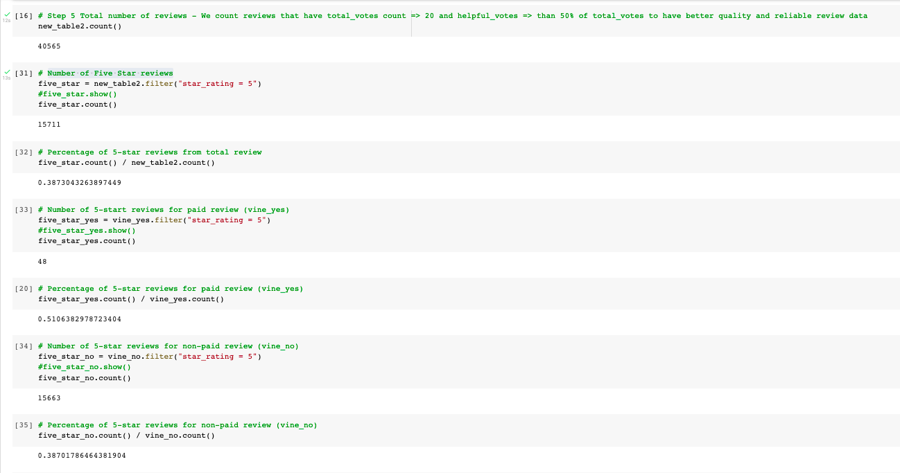

# **Module16-BigData Vine Review Analysis**

## **Overview of the Analysis**

### For this analysis, I have selected the video games data set from amazon reviews and use PySpark to perform the ETL process to extract the dataset, transform the data, connect to an AWS RDS instance, and load the transformed data into pgAdmin. Next, I used PySpark to determine if there is any bias toward favorable reviews from Vine members in the dataset and wrote a summary of the analysis and findings.

## **Results**

### Before doing the analysis I had to do some filtering on the vine table (original data count vine_df: 1,785,997) to get more accurate and usefull review data set.  The filters are total_votes count >= 20 and percentage of helpful_votes >= 50%.  The new data set count after filtering new_table2: 40,565.

### How many Vine reviews and non-Vine reviews were there?

### After filtering the new_table2 data by vine =='Y' and vine == 'N', there are 94 Vine reviews and 40,471 non-Vine reviews.

### How many Vine reviews were 5 stars? How many non-Vine reviews were 5 stars?

### Using the 40,565 review data as base, I calculated the 5-stars reviews as follows:

###    - Number of 5-star reviews from the whole data set is 15,711
###    - Percentage of 5-star reviews from total review is 38.7%
    
###    - Number of 5-star reviews for paid review (vine_yes) is 48
###    - Percentage of 5-star reviews for paid review (vine_yes) is 51.07%
    
###    - Number of 5-star reviews for non-paid review (vine_no) is 15,663
###    - Percentage of 5-star reviews for non-paid review (vine_no) is 38.7%

### Detail calculations can be seen in the image bellow:

## **Summary**

### As we can see the percentages of 5-star ratings between the whole review and non-paid review are similar at around 38.7%.  However, 5-star ratings for the paid review is significantly higher at 51.07%.  This could indicate there is a positivity bias for reviews in the Vine program for this paticular product group, i.e. video games.  Additional analysis that could be done is by doing further filtering on verified_purchase Y or N data and calculate 5-star ratings on paid-verified, paid-unverified, unpaid-verified, and unpaid-unverified data.
